

# 🌟 Day 1 Takeaways from AI4TS @ ICDM 2025 in Washington, DC! 🌟

I spent an incredibly stimulating day at the **AI for Time Series Analysis: Theory, Algorithms, and Applications (AI4TS)** workshop ([link](https://ai4ts.github.io/icdm2025)), diving deep into the cutting edge of **time series (TS)** modeling.

A central theme that resonated with me across several talks was the growing, yet still evolving, role of **causality** in TS analysis.

---

## Key Highlights & Insights

### 1️⃣ “Four Pillars for PTS Analysis” & “TSFMs for Perception” – Agnes F. Liu (University of Maryland)

A good and concise summary of the **state-of-the-art in TS models**, offering a fresh perspective on integrating these models for complex systems.  
The concept of **Temporal Foundation Models (TSFMs)** as the pillar for *Perception* (as shown in the slides) is a nice one and gives a modular view of TS pipelines.

---

### 2️⃣ “TS-CausalNN: Learning Temporal Causal Relations from Non-linear Non-stationary Time Series Data” – Omar Faruque (University of Maryland)

This talk sat right at the intersection of:
- **Causal discovery**
- **Time series**
- **Continuous optimization**

Very much in the spirit of **NOTEARS (Zheng et al., 2018)** but tailored to temporal structure. This is exactly the kind of direction that connects my own interests in causal modeling and TS.

---

### 3️⃣ Keynotes by Dr. Panagiotis Papapetrou (Stockholm University) & Dr. Rex Ying (Yale University)

- **Dr. Papapetrou** touched on **counterfactuals in time series**, but interestingly, causality itself mostly appeared as “future work,” even though counterfactuals are inherently causal concepts by nature.

- **Dr. Ying** discussed **benchmarking TS models**, including issues like poor alignment due to missing causal links. From my **Pearl-style causality** lens, the way causality entered these benchmarks still feels *non-causal*—or at least not yet explicitly framed in that language.

---

## Overall Impression

There are **huge opportunities at the intersection of time series modeling and causal reasoning**, both in terms of:
- **Theory** (causal structure in temporal models, counterfactuals for TS), and  
- **Practice** (benchmarks, evaluation, robustness across domains).

Stay tuned for more updates from ICDM 2025!

**Tags:**  
`#ICDM2025` `#AI4TS` `#TimeSeries` `#Causality` `#DeepLearning` `#DataScience` `#FoundationModels`

  <figure class="slide">
    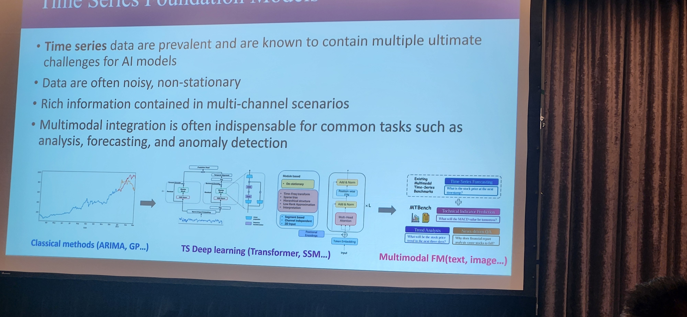
    <figcaption><em>Agnes F. Liu’s slide on Time Series Foundation Models and multimodal FMs.</em></figcaption>
  </figure>

  <figure class="slide">
    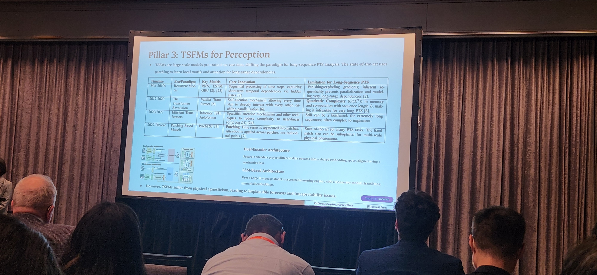
    <figcaption><em>“Pillar 3: TSFMs for Perception” — positioning TSFMs as the perception layer in physical time-series analysis.</em></figcaption>
  </figure>

  <figure class="slide">
    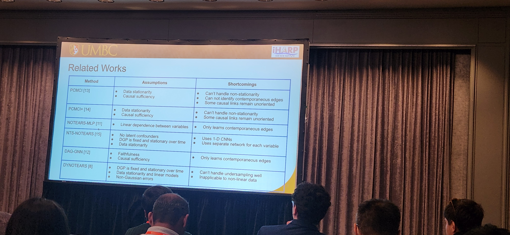
    <figcaption><em>Related works slide for TS-CausalNN, comparing assumptions and shortcomings of existing temporal causal methods.</em></figcaption>
  </figure>

  <figure class="slide">
    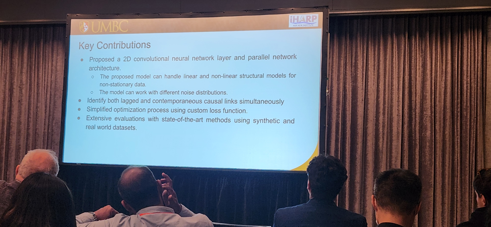
    <figcaption><em>Key contributions of TS-CausalNN — learning lagged and contemporaneous causal links in non-stationary time series.</em></figcaption>
  </figure>

  <figure class="slide">
    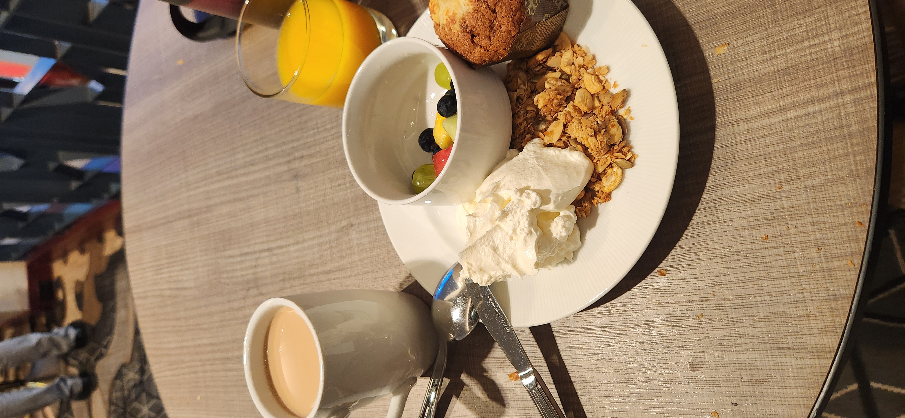
    <figcaption><em>Day 1 breakfast fuel: granola, fruit, muffin, yogurt, coffee, and orange juice before AI4TS.</em></figcaption>
  </figure>

  <figure class="slide">
    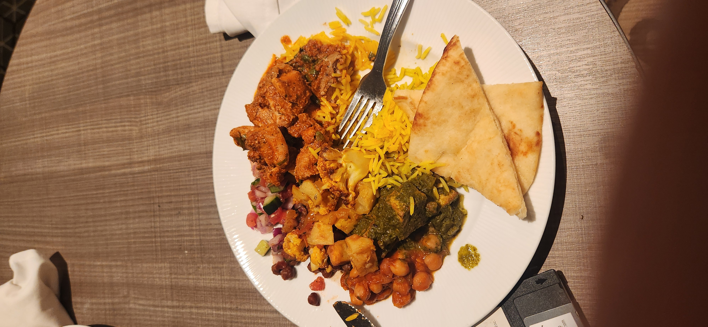
    <figcaption><em>Day 1 lunch — colorful buffet plate between workshop sessions.</em></figcaption>
  </figure>

  <figure class="slide">
    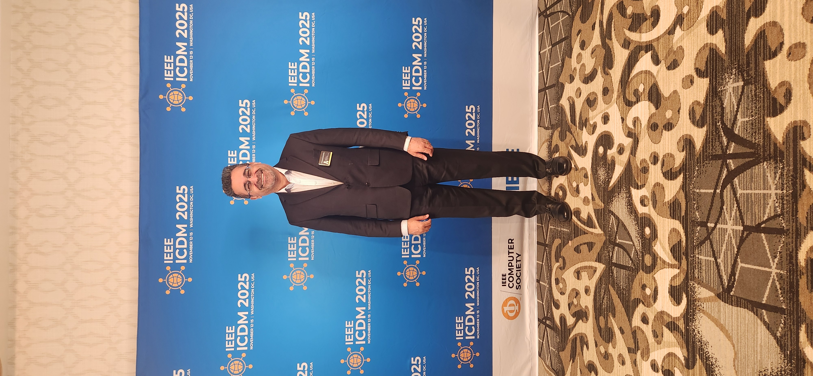
    <figcaption><em>Formal shot at the IEEE ICDM 2025 backdrop.</em></figcaption>
  </figure>

  <figure class="slide">
    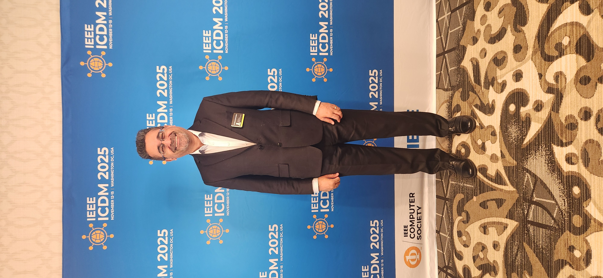
    <figcaption><em>Another ICDM 2025 backdrop photo to remember Day 1.</em></figcaption>
  </figure>

  <figure class="slide">
    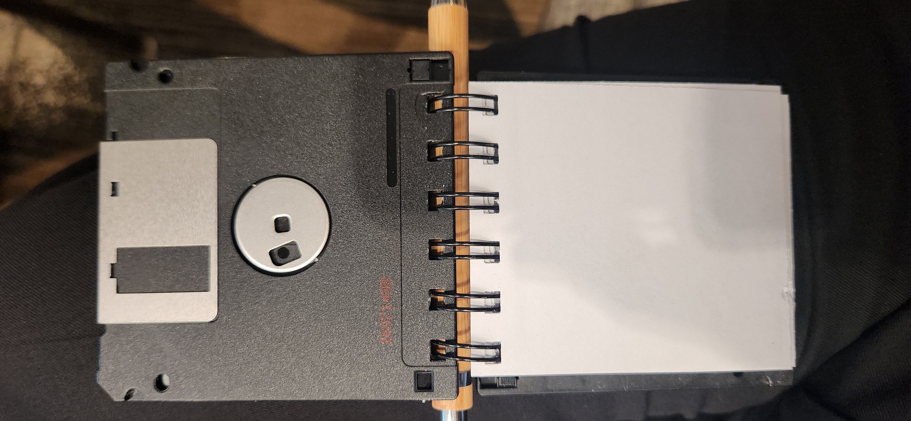
    <figcaption><em>Retro floppy-disk style notebook — conference swag with a CS flavor.</em></figcaption>
  </figure>

  <figure class="slide">
    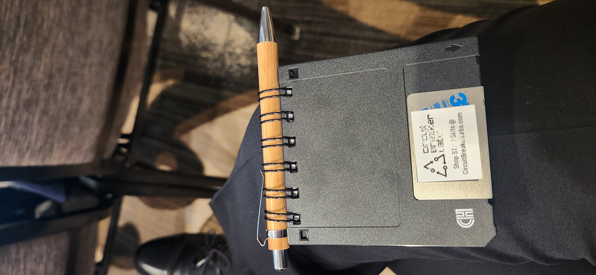
    <figcaption><em>Back view of the floppy-disk notebook with matching pen.</em></figcaption>
  </figure>

  <figure class="slide">
    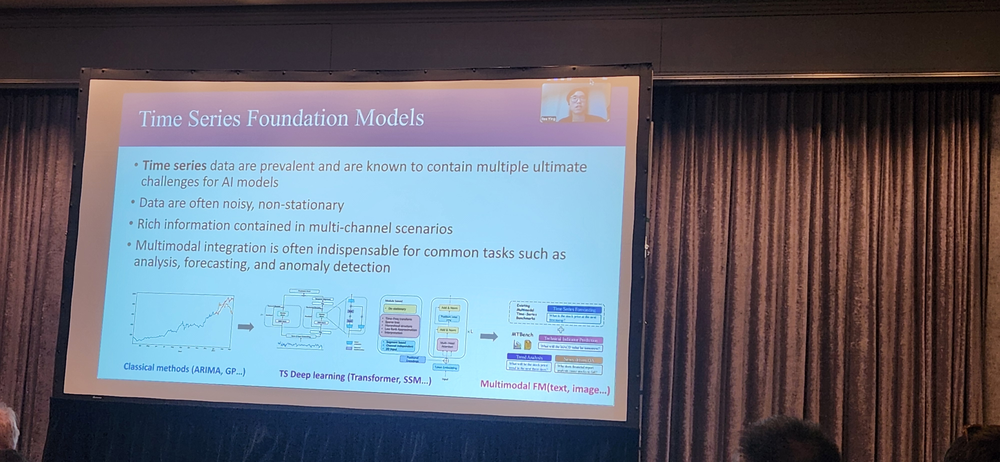
    <figcaption><em>Time Series Foundation Models.</em></figcaption>
  </figure>

  

    <button class="prev">⟨ Prev</button>
    <button class="next">Next ⟩</button>
  

