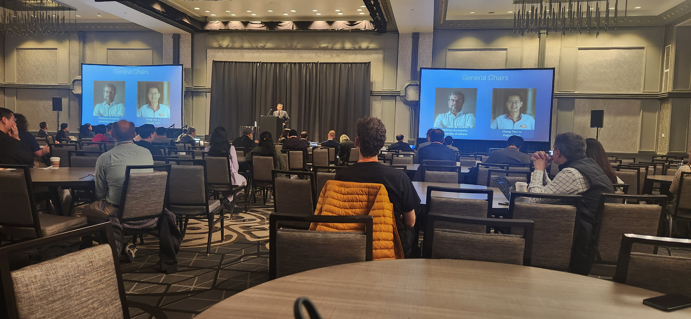
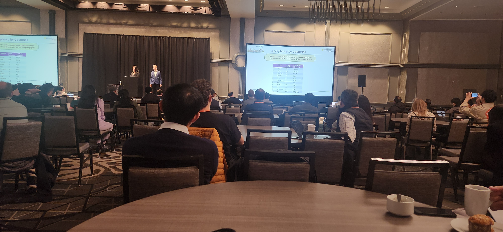
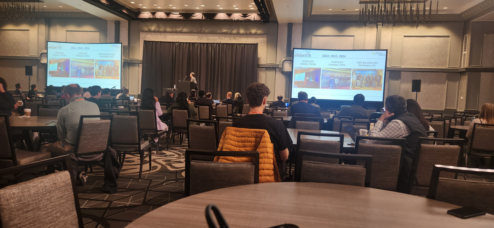
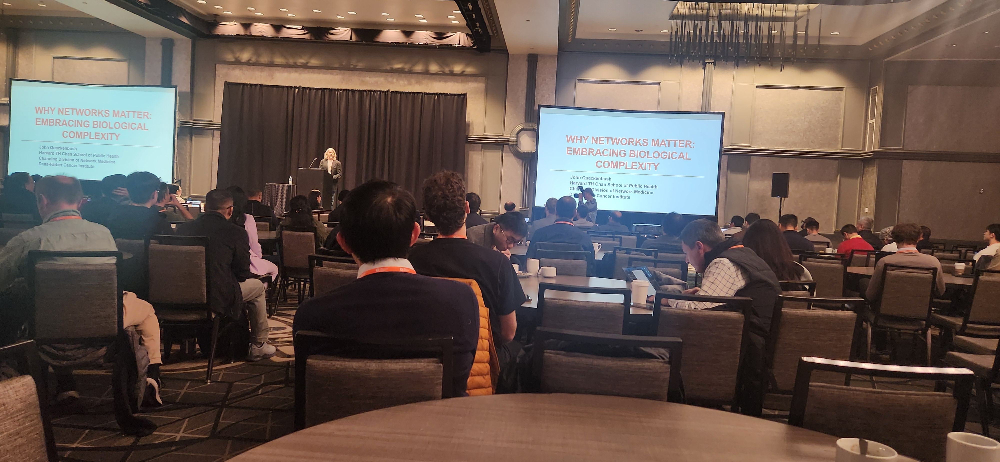
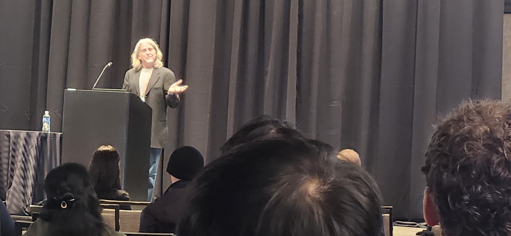
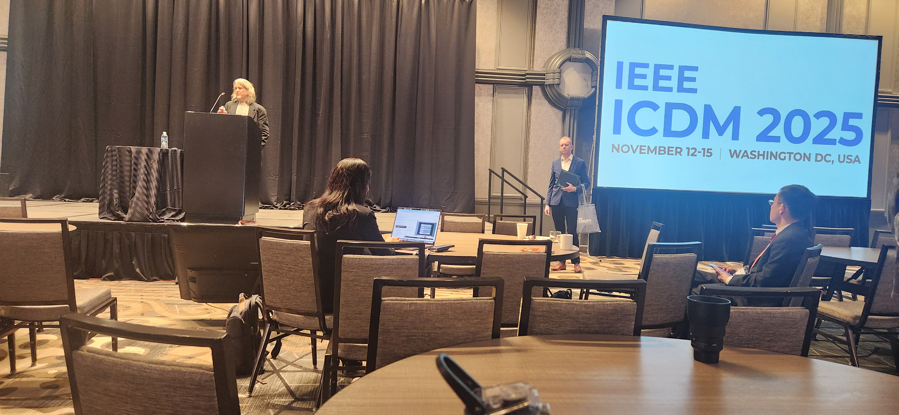
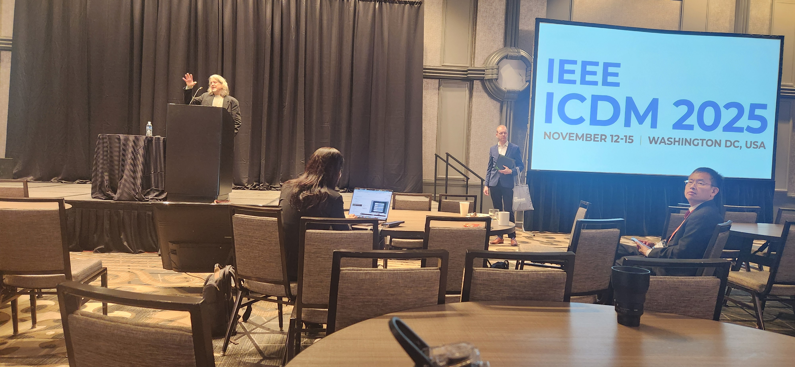
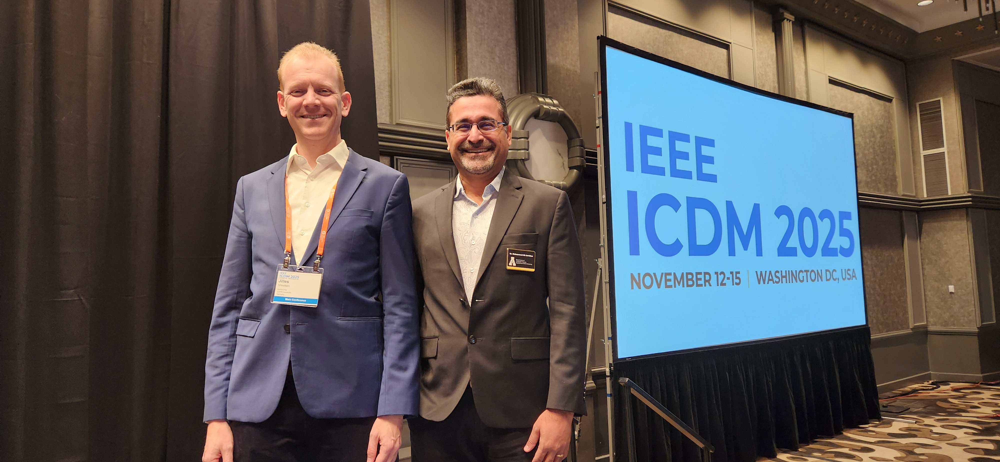
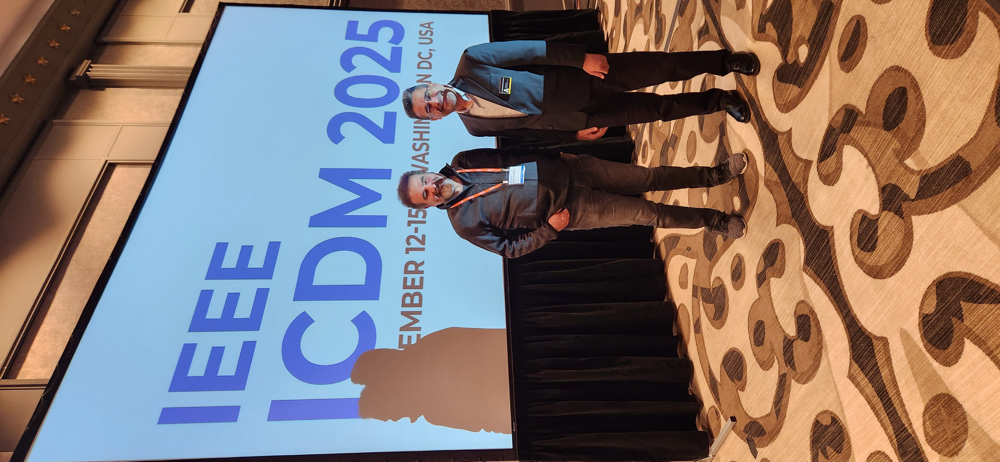
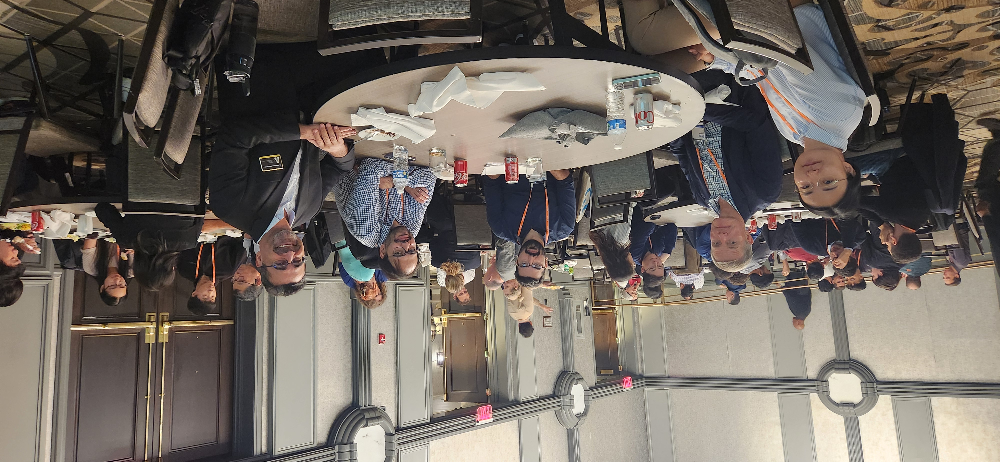

# 🌟 Day 2 – Takeaways from ICDM 2025, Washington, DC 🌟

Another intense and inspiring day at ICDM 2025. A few highlights and reflections from today:

---

## 9:00–10:00 – Keynote by Dr. John Quackenbush (Harvard University)

**Title:** *“Why Networks Matter: Embracing Biological Complexity”*

My takeaway:
- Biology is **not easy**, and there is **no free lunch** theorem here.
- Heavy reliance on **simulated data** can be misleading for biology—Dr. Quackenbush clearly prefers real, messy data over clean simulations.

---

## 10:00–10:30 – Meeting Dr. Jilles Vreeken

I met **Dr. Jilles Vreeken** in person, the Program Chair of ICDM 2025. He and **Dr. Wei Ding** (UMass Boston) have introduced several innovations into this year’s conference format. The presented stats are interesting and speak for themselves.

We had a great half-hour conversation about **causality**, especially:
- His seminal work on **MDL for causal inference**, and  
- His current projects on **causal invariants** and **domain adaptation**.

Very aligned with my own research interests.

---

## 10:30–12:00 – Panel A: “The Future of Probabilistic Modeling in Data Mining and AI”

The panel focused on challenges such as:
- **Scalability**
- **Explainability** (the *“why”* questions)
- The **mathematical foundations** of LLMs and other advanced models

In the Q&A, I raised the point that many of these concerns are *exactly* what **causality** is designed to address—yet causality was barely mentioned.

My takeaways from the responses:

- Research often **follows funding and mainstream trends**.  
- Formal **axiomatizations of causality** are still relatively young (only a few decades old), and there is uncertainty about what a full **“causal turn”** in AI would imply.

---

## 15:00–16:00 – Main Track S16: Interpretability

I attended three talks in the interpretability session. While technically interesting, I left wanting more:

- Little clarity on **how** the proposed models are interpretable.  
- Almost no discussion of **how interpretability was quantified**.

A reminder that **interpretability is often claimed but rarely operationalized**.

---

## 16:00–17:00 – Main Track S15: Time Series I

One talk on **few-shot domain adaptation for time series** really caught my attention—a novel framework designed for few-shot *unsupervised* domain adaptation.

I’ll definitely be reading that paper more carefully for new ideas related to my work on **causal** and **robust TS** methods.

---

## Poster Session

The poster display was, unfortunately, the least engaging part of the day:
- Many authors were absent due to scheduling conflicts.

With better time allocation and fewer overlaps, this could be a much richer venue for deep, one-on-one scientific conversations—far more than the few minutes available in Q&A at the end of talks.

---

## Closing Thought

Overall, Day 2 reinforced for me how much room there is to bring **causal thinking**, **interpretability**, and **careful evaluation** into mainstream data mining and AI, especially in **biology** and **time series**.

More reflections coming soon. Stay tuned! 🚀📊

  <figure class="slide">
    
    <figcaption><em>Opening session – introducing the ICDM 2025 General Chairs.</em></figcaption>
  </figure>

  <figure class="slide">
    
    <figcaption><em>Prof. Wei Ding and Prof. Jilles Vreeken on stage as ICDM 2025 Program Chairs.</em></figcaption>
  </figure>

  <figure class="slide">
    
    <figcaption><em>Acceptance statistics by country – 3,009 authors from 50 countries, 176 accepted papers.</em></figcaption>
  </figure>

  <figure class="slide">
    
    <figcaption><em>“ICDM in the past” – snapshots from Orlando (2022), Shanghai (2023), and IEEE Big Data 2024 in Washington DC events.</em></figcaption>
  </figure>

  <figure class="slide">
    
    <figcaption><em>Room view during the keynote “Why Networks Matter: Embracing Biological Complexity.”</em></figcaption>
  </figure>

  <figure class="slide">
    
    <figcaption><em>Dr. John Quackenbush explaining why biological networks are so challenging and fascinating.</em></figcaption>
  </figure>

  <figure class="slide">
    
    <figcaption><em>Keynote session – speaker on stage with the IEEE ICDM 2025 backdrop.</em></figcaption>
  </figure>

  <figure class="slide">
    
    <figcaption><em>Another moment from the keynote, emphasizing the complexity of biological data.</em></figcaption>
  </figure>

  <figure class="slide">
    
    <figcaption><em>Wide shot of the keynote room – plenty of space for thinking and note-taking.</em></figcaption>
  </figure>

  <figure class="slide">
    
    <figcaption><em>A memorable moment with Dr. Siadat at ICDM 2025.</em></figcaption>
  </figure>

  <figure class="slide">
    
    <figcaption><em>Panel A-The Future of Probabilistic Modeling in Data Mining and AI.</em></figcaption>
  </figure>

  <figure class="slide">
    
    <figcaption><em>Lunch with Panel A organizers.</em></figcaption>
  </figure>

  

    <button class="prev">⟨ Prev</button>
    <button class="next">Next ⟩</button>
  

