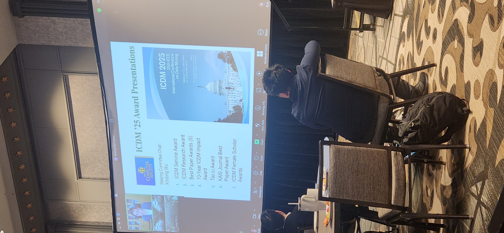
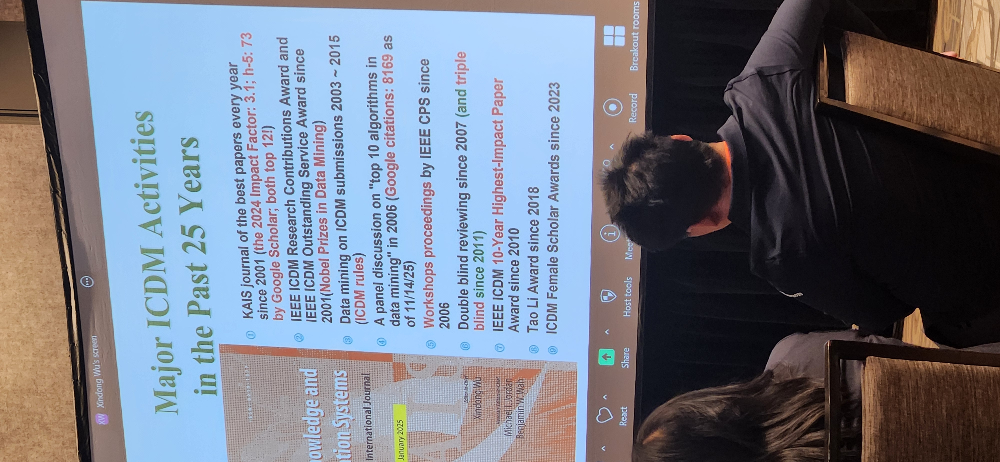
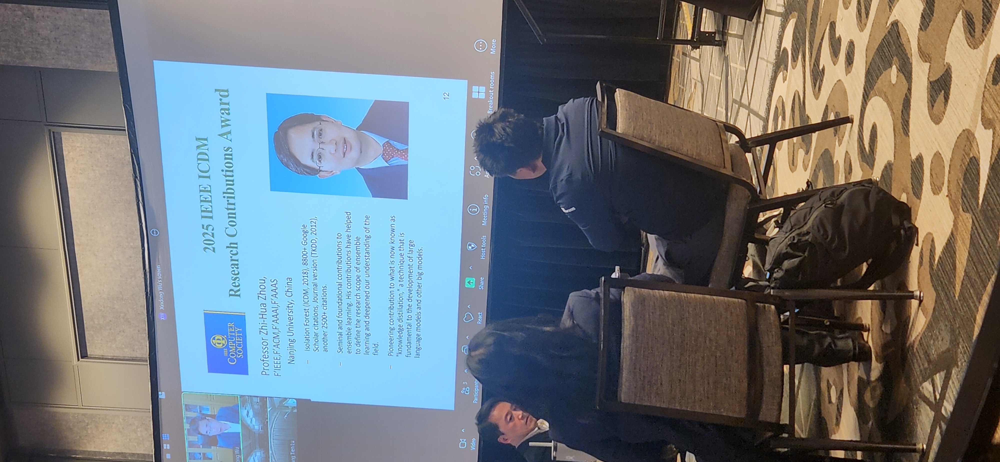
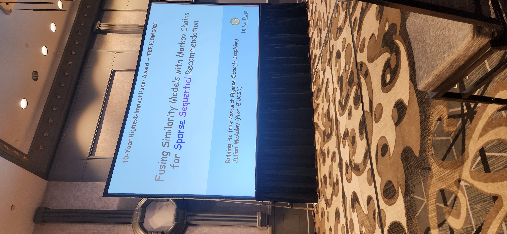
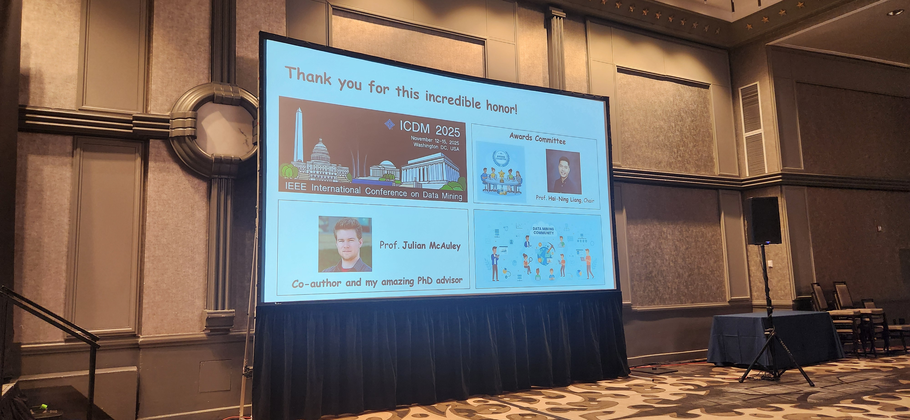
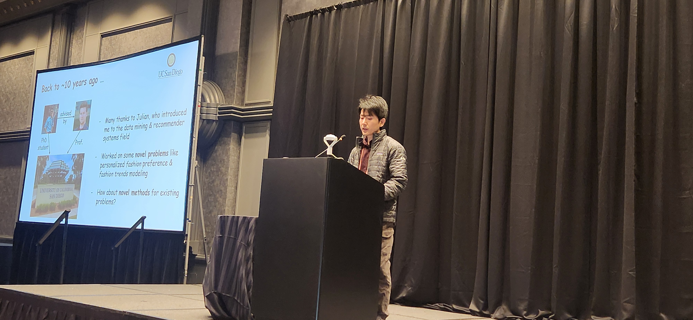
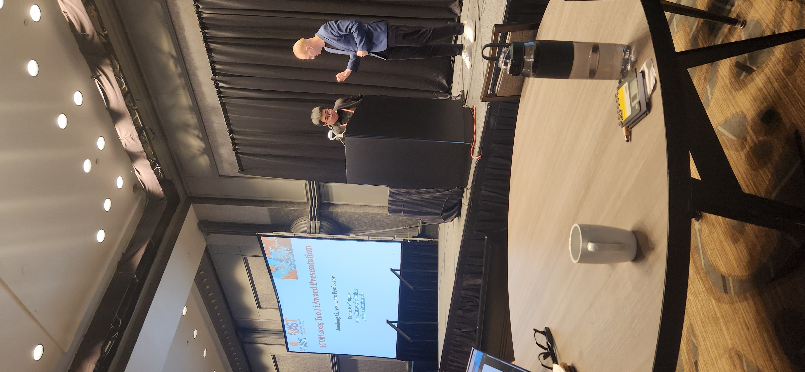
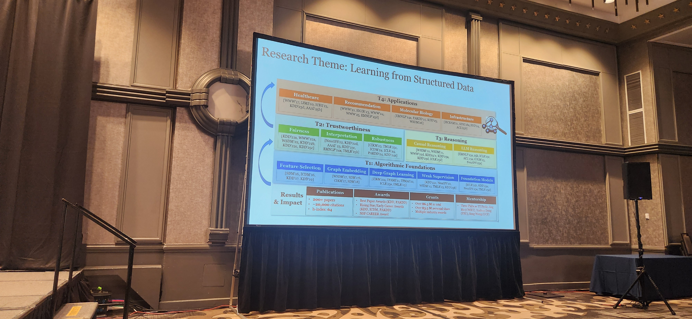
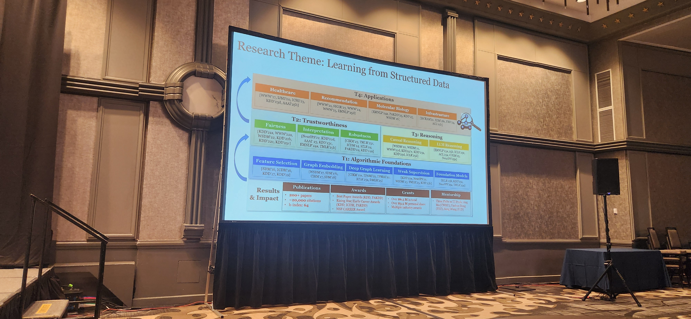

# 🌟 Day 3 – Takeaways from ICDM 2025, Washington, DC 🌟

---

## 8:30–9:00 – ICDM Award Announcements

Two awards especially caught my eye:

🏆 **Best Paper:**  
*“Attributed Hypergraph Generation with Realistic Interplay Between Structure and Attributes”*  
**Authors:** Jaewan Chun, Seokbum Yoon, Minyoung Choe, Geon Lee, Kijung Shin (KAIST)

🏆 **Best Student Paper:**  
*“HyHG: A Temporal Hypergraph Contrastive Learning Framework for Biomedical Hypothesis Generation”*  
**Authors:** Amir Shariatmadari, Sikun Guo, Nathan Sheffield, Aidong Zhang (University of Virginia),  
Kishlay Jha (University of Iowa)

Both works rely on **hypergraphs** to tackle modern challenges in **data mining** and **knowledge discovery**—another reminder of how deep **graph theory** and **mathematics** remain central to computer science.

---

## A Fun Personal Story

Earlier in the conference, during a morning coffee break, I decided to be more proactive and just sit down at a random table and start a conversation.

I ended up talking with a young researcher from South Korea—turns out he was **Jaewan**, a first-year PhD student working on **hypergraph generators** and the **best paper winner**!

I mentioned my own earlier work on **hypergraphs** with **Marco Valtorta**, **Lincoln Lu**, and **Zhiyu Wang** from my PhD days. It was a bit of an **awakening moment** that I should revisit this topic more seriously in my current proposal work.

---

## Keynote – Dr. Aidong Zhang (University of Virginia)

**Title:** *“Optimizing External and Internal Knowledge of Large Foundation Models for Scientific Discovery”*

My takeaway:

- LLMs can be **more innovative in hypothesis generation** than individual humans because they tap into a vast and diverse pool of scientific knowledge.
- But their ideas are often **less feasible in practice**.

Human judgment is still crucial to:
- Filter  
- Refine  
- Ground these hypotheses in realistic constraints.

---

## Plenary Panel – Where Is Data Mining Going?

Three big questions structured the discussion:

1️⃣ **Data mining vs. foundational models**  
2️⃣ **Can LLMs defend the hypotheses they generate?**  
3️⃣ **What will data mining look like in the next decade?**

Jilles Vreeken made a provocative statement:  
> “Data mining is dead” — but its core objective, **knowledge discovery**, is very much alive.

Another key message:
- Science is **more than LLMs**.  
- We shouldn’t put all our eggs in one basket or spend all our talent only tweaking foundation models.

There was even some discussion about whether the conference itself should eventually **rebrand around “knowledge discovery.”**

---

## Evening Banquet – International Spy Museum 🕵️‍♂️

The day ended with the **banquet and award ceremony** at the International Spy Museum.

I had a long and insightful conversation with **Dr. Mohamed Nafea (Missouri S&T)** about:
- **Causality**
- **Fairness**

I also shared my struggles with securing external funding. He told me about a colleague who finally succeeded **after 21 submissions**.

A powerful reminder for all early-career researchers:

- 🔁 *Be resilient.*  
- 💡 *Stay confident in your ideas.*  
- ⏳ *Persistence often matters as much as brilliance.*

More reflections and photos from ICDM 2025 coming soon—stay tuned! 🚀📊

  <figure class="slide">
    
    <figcaption>Opening session of the morning plenary — the hall begins to fill for the main award and panel segments.</figcaption>
  </figure>

  <figure class="slide">
    
    <figcaption>“Major ICDM Activities in the Past 25 Years” — a retrospective on milestones such as double-blind reviewing and the KAIS journal partnership.</figcaption>
  </figure>

  <figure class="slide">
    
    <figcaption>Announcement of the 2025 ICDM Research Contributions Award — honoring Prof. Zhi-Hua Zhou (Nanjing University) for seminal ensemble learning work.</figcaption>
  </figure>

  <figure class="slide">
    
    <figcaption>10-Year Highest-Impact Paper Award — *“Fusing Similarity Models with Markov Chains for Sparse Sequential Recommendation.”*</figcaption>
  </figure>

  <figure class="slide">
    
    <figcaption>“Thank you for this incredible honor!” — a moment of appreciation from the awardees to the ICDM community.</figcaption>
  </figure>

  <figure class="slide">
    
    <figcaption>Ruining He reflecting on a decade of progress — from early recommender systems research to industrial-scale ML at Google DeepMind.</figcaption>
  </figure>

  <figure class="slide">
    
    <figcaption>Slide introducing the ICDM 2025 Tao Li Award Presentation — honoring outstanding contributions in data mining.</figcaption>
  </figure>

  <figure class="slide">
    
    <figcaption>Jundong Li presenting the ICDM 2025 Tao Li Award.</figcaption>
  </figure>

  <figure class="slide">
    
    <figcaption>Research Theme — *Learning from Structured Data*: an integrative view of algorithmic foundations, trustworthiness, reasoning, and applications.</figcaption>
  </figure>

  <figure class="slide">
    
    <figcaption>Detailed structure of the *Learning from Structured Data* theme — linking fairness, robustness, causal reasoning, and LLM reasoning layers.</figcaption>
  </figure>
  

    <button class="prev">⟨ Prev</button>
    <button class="next">Next ⟩</button>
  

