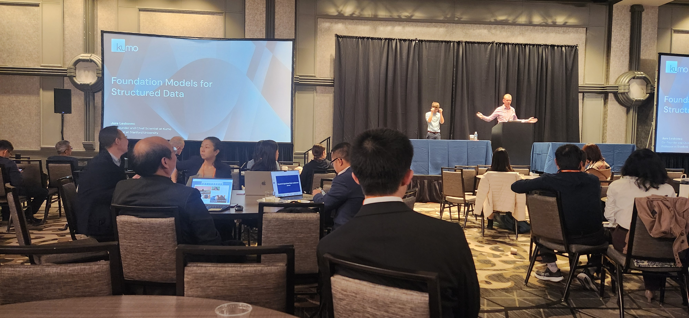
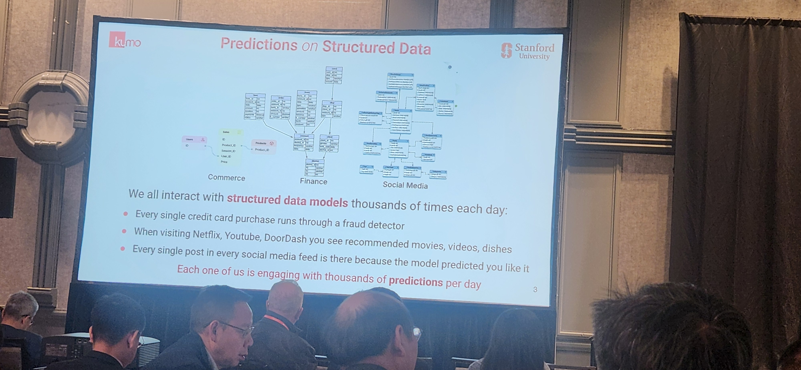
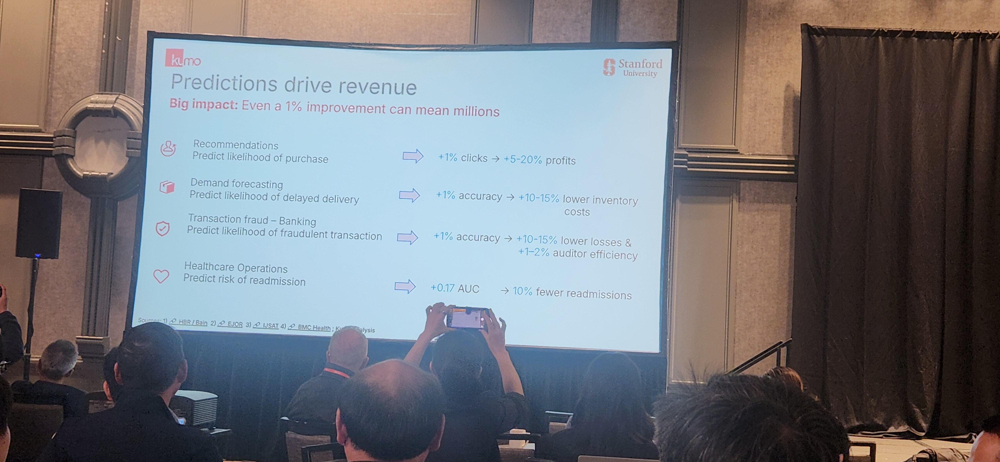
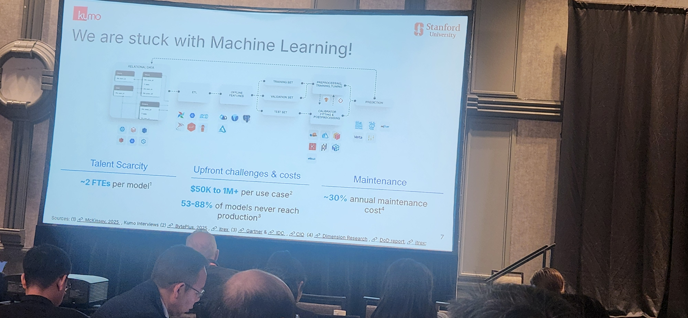
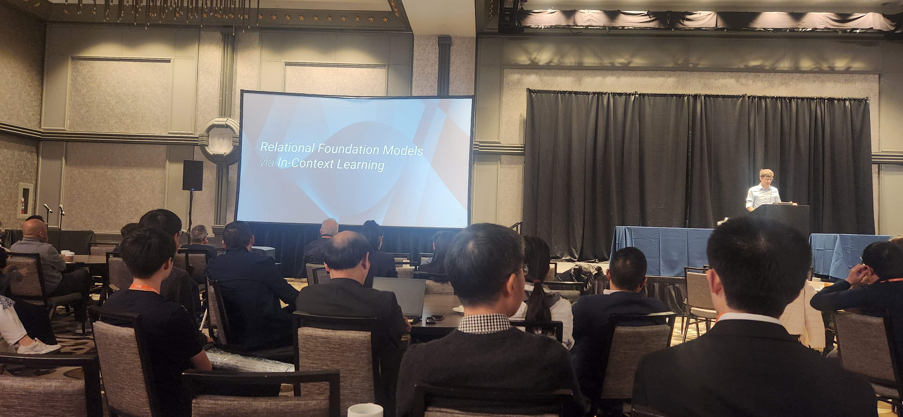
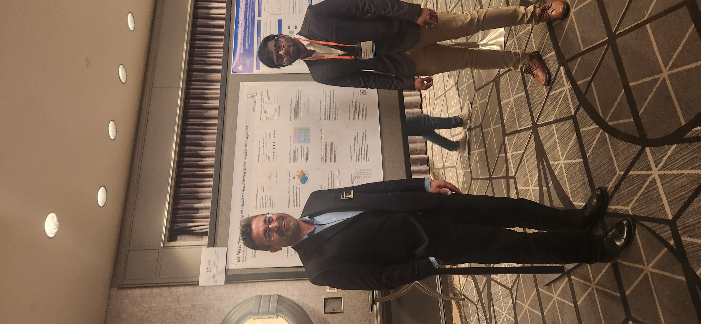
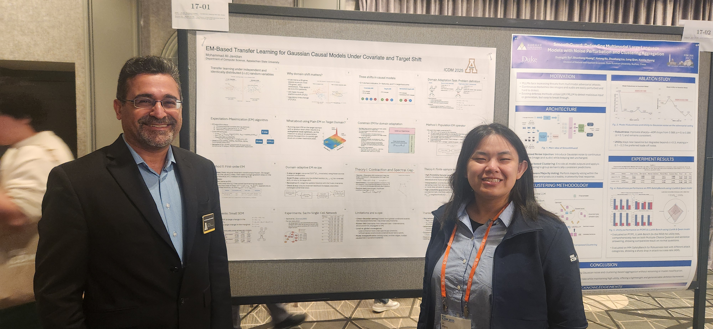
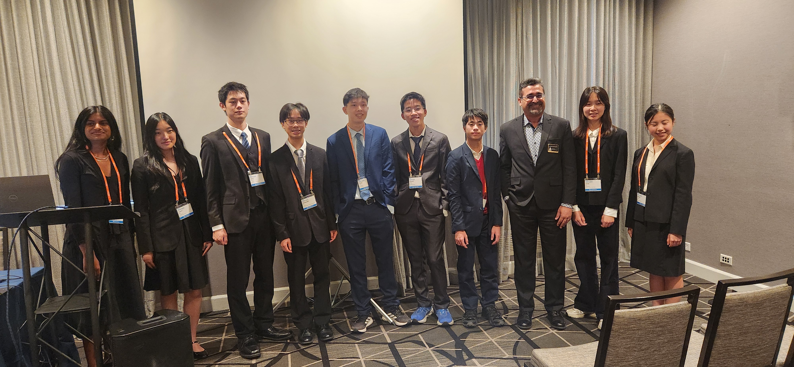
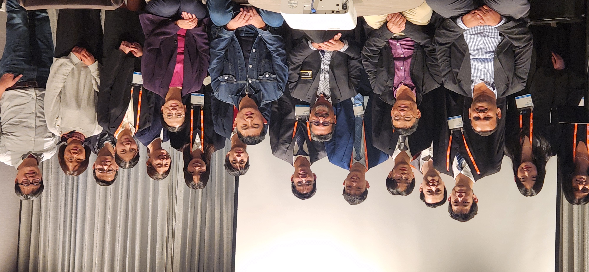

# 🌟 Day 4 – Takeaways from ICDM 2025, Washington, DC 🌟

Today was my last day at ICDM 2025, and it was a great way to wrap up an intense and inspiring week.

---

## Keynote III – Dr. Jure Leskovec (Stanford University)

**Title:** *“Relational Foundation Models: A New Frontier for Predictive AI in Structured Data”*

Dr. Leskovec emphasized that **relational data** is the most important and fascinating type of data.

Key points:
- The backbone of his **Relational Foundation Model** is **not** an LLM, but it still leverages **attention mechanisms**.  
- Science is **not limited to LLMs**; we will likely need different kinds of **foundation models** for knowledge and scientific discovery.

His ideas on relational foundation models also sparked several new thoughts for me on **domain adaptation**, which I plan to explore further in my own research.

---

## 10:00–12:00 – Poster Session

I spent the late morning at the Poster Display, where I **presented my poster** and had some thoughtful conversations about my work.

---

## Afternoon – Session Chair, Undergraduate & High School Symposium

In the afternoon, I served as **Session Chair** for the **Undergraduate and High School Symposium**:

- 6 presentations total  
  - 1 undergraduate  
  - 5 high-school teams

The research quality, professionalism, and depth of the Q&A discussions were all very impressive.

I genuinely felt I was **seeing the future of science in these students**. 🚀

---

## 16:00–17:30 – Foundations Session (Paper Presentation)

I also presented my paper in the **Foundations** session (only three papers in the slot).

A striking moment: when I mentioned the **EM algorithm** and asked for a show of hands, **less than 30% of the audience** was familiar with it.

This really reinforced a concern I’ve had for a while:

> We must keep teaching our students **fundamental algorithms and principles**, not just how to tweak LLMs.  
> Without strong foundations, “foundation models” are sitting on **shaky ground**.

---

## Closing Ceremony (17:40–18:30)

The day ended with the **closing ceremony**. It was announced that **ICDM 2026 will be held in Shenyang, China**.

---

## Final Reflection

ICDM 2025 has been both **intellectually rich** and **personally motivating**.  

I’ll share a few photos from my talk, poster session, and today’s events alongside this blog.

Thanks to all the organizers, speakers, and participants for a memorable conference. 🙏

<figure class="slide">
  
  <figcaption>Keynote by Dr. Jure Leskovec on foundation models for structured data.</figcaption>
</figure>

<figure class="slide">
  
  <figcaption>Illustration of how predictions on structured data power everyday applications.</figcaption>
</figure>

<figure class="slide">
  
  <figcaption>Emphasis on the economic impact of accurate predictions from structured data models.</figcaption>
</figure>

<figure class="slide">
  
  <figcaption>Discussion of talent scarcity, high costs, and maintenance challenges in traditional ML pipelines.</figcaption>
</figure>

<figure class="slide">
  
  <figcaption>Introduction of relational foundation models as a new paradigm for predictive AI on structured data.</figcaption>
</figure>

<figure class="slide">
  
  <figcaption>Presenting my poster on EM-based transfer learning for Gaussian causal models under covariate and target shift.</figcaption>
</figure>

<figure class="slide">
  
  <figcaption>Discussing the poster and research contributions with conference attendees.</figcaption>
</figure>

<figure class="slide">
  
  <figcaption>Further conversations at the poster session about domain adaptation and causal models.</figcaption>
</figure>

<figure class="slide">
  
  <figcaption>Group photo with the undergraduate and high school symposium presenters after the session.</figcaption>
</figure>

<figure class="slide">
  
  <figcaption>Closing group picture with student researchers and their parents.</figcaption>
</figure>

    <button class="prev">⟨ Prev</button>
    <button class="next">Next ⟩</button>
  

