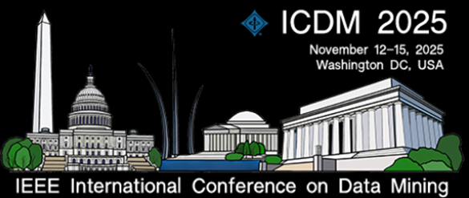

# ICDM 2025 – Conference Diary (Washington, DC)

<figure class="slide">
  
  <figcaption>
    
    ICDM 2025 – IEEE International Conference on Data Mining, Washington, DC (November 12–15, 2025).
  </figcaption>
</figure>

This mini-blog collects my reflections and notes from four days at ICDM 2025 in Washington, DC, with a particular focus on time series, causality, foundation models, and the evolving identity of data mining as a field.

[Official ICDM 2025 conference website →](https://www3.cs.stonybrook.edu/~icdm2025/)

## Posts

- [🌟 Day 1 – AI4TS Workshop: Time Series, Causality & TS Foundation Models](day1.md)
- [🌟 Day 2 – Keynotes, Panels & the Missing Causal Lens](day2.md)
- [🌟 Day 3 – Awards, Hypergraphs, Knowledge Discovery & Resilience](day3.md)
- [🌟 Day 4 – Relational Foundation Models, Foundations Session & Future of Science](day4.md)

---

**Acknowledgment.** Special thanks to **Dr. Jay Fenwick** for his support in making this trip and conference diary possible.
